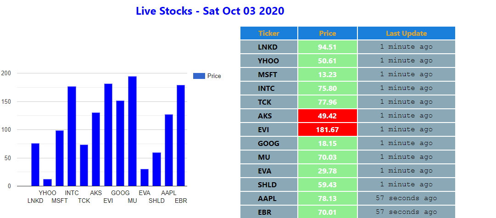

Live Stock App
================================================

### Introduction

Live Stock app is a react job assessment project. It is meant to pull subscribe for updates via websockets (server url: ws://stocks.mnet.website). It then display the data on a table and on a bar chart live and changes as the price of the stock changes.

### Built with

*   Node.js
*   React
*   React-DOM
*   React-Create-App
*   React-Hooks
*   React-google-charts
*   TimeAgo react package

### Features

* Display stock data/price/last updated time
* Displays and updates chart as price of stock varies

### live Demo

 Getting Started
---------------

### Prerequisites
Install node
### Setup

clone the project repo navigate into the project directory; cd live-stock-app

### Install

install dependencies by running $ yarn install

### Usage

yarn start

👤 **Author**
Ngodi albert
- Github: [@ngodi](https://github.com/ngodi)
- Twitter: [@albertngodi](https://twitter.com/albertngodi)
- Linkedin: [linkedin](https://www.linkedin.com/in/albertngodi/)

### License

This project is MiT licensed.
